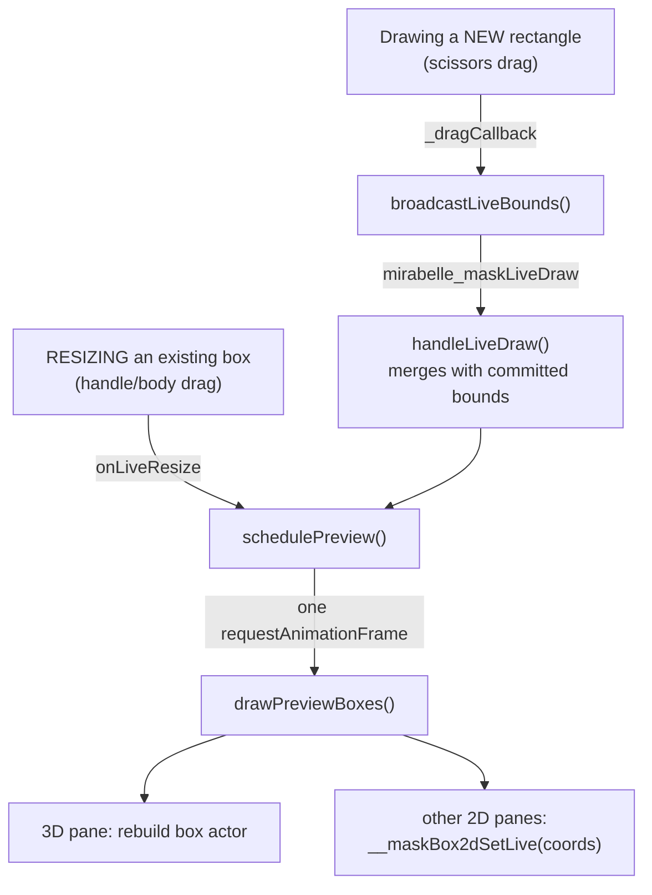
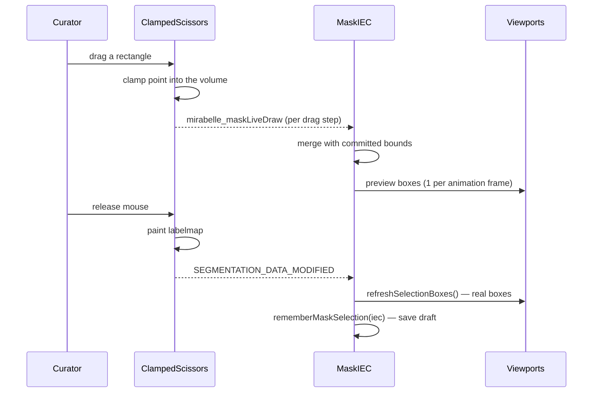
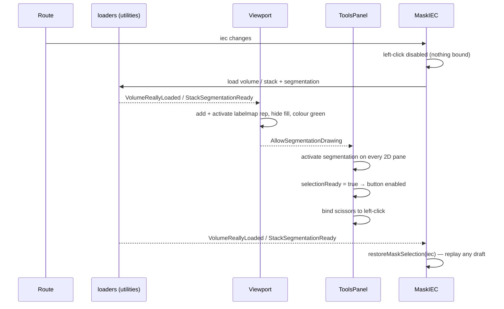

# Masking Improvements — what this branch changes and how it works

Branch: `masking-improvements-develop` (branched from `develop` at `c9e5da6`)

This document explains **every code change on this branch**, and the concepts
you need to follow them. It assumes you know React but **not** Cornerstone3D or
medical imaging, so Part 1 builds the vocabulary first. If you already know the
domain, skip to [Part 3](#part-3--the-one-big-idea).

---

## Part 0 — The short version

Curators use the Mask route to draw a **3D box** around the part of a scan that
should be masked. This branch rebuilds that drawing experience.

**Before this branch:**

- You drew a rectangle, then pressed a separate **"Expand Selection"** button to
  turn it into a 3D region. Two steps, and easy to forget the second one.
- Once drawn, the selection could not be adjusted. Wrong box? Clear it and start
  over.
- The box only appeared in the pane you drew it in. The 3D view and the other
  panes didn't show it until you finished.
- You could drag past the edge of the image, creating a selection partly outside
  the data — with edges you couldn't see.
- The window-level tool grabbed the left mouse button on every load, so you had
  to re-select the drawing tool each time. Drawing too early threw
  `No active segmentation detected`.
- Navigating to another exam silently threw away an unsubmitted selection.

**After this branch:**

- Drawing a rectangle *is* the selection. No expand step.
- The box can be **moved and resized** by dragging it or its 8 handles.
- Every pane — all 2D slices **and** the 3D view — updates **live** as you drag.
- Drawing is **clamped** to the image, so a selection can never leave the data.
- A faint blue frame shows exactly where those drawing limits are.
- The drawing tool is armed automatically once the image is ready, and its
  button is greyed out until then.
- Unsubmitted selections **survive navigation** between exams.

Eight commits, 21 files, ~1,670 added lines.

---

## Part 1 — Concepts you need

### 1.1 IEC — the unit of work

An **IEC** is one exam/image series — the thing a curator masks. The route is
`/mira/mask/vr/{visualReview}/{iec}/...`. Curators work through a queue of IECs,
one at a time.

### 1.2 Volume vs. stack — two very different shapes of data

This distinction explains most of the "why are there two code paths?" in this
branch.

| | **Volume** (`volumetric: true`) | **Stack** (`volumetric: false`) |
|---|---|---|
| What it is | A true 3D grid of voxels | A pile of independent 2D images |
| Panes shown | 3 slice views + 1 3D view | 1 image view |
| Can it be re-sliced? | Yes (axial/coronal/sagittal) | No |
| Where selection bounds live | Tracked automatically by Cornerstone | Must be found by scanning pixels |

Almost every function on this branch has a `if (volumetric) { … } else { … }`
fork for exactly this reason.

### 1.3 Viewports and the rendering engine

A **viewport** is one rendering pane. A **rendering engine** owns them all.
Panes are identified by string ids, which the code pattern-matches:

```js
const is3dViewport = (id) => id.startsWith("coronal3d");           // the 3D pane
const is2dViewport = (id) => id.endsWith("2d") || id === "myviewport";
//                            ^ volume slice panes    ^ the stack pane
```

### 1.4 IJK vs. world coordinates — the most important concept here

Two coordinate systems, used constantly:

- **IJK** — integer **voxel indices**. "Voxel number 40 across, 55 down, 12
  deep." Grid coordinates. No physical meaning.
- **World** — real **millimetre positions** in the patient. What the screen and
  the 3D scene actually use.

Converting between them is `imageData.indexToWorld(ijk)` and
`imageData.worldToIndex(world)`. This conversion bakes in the volume's origin,
spacing, and **direction** (rotation).

> **Why this matters so much:** some scans are *tilted* (gantry tilt) or
> oblique, so their voxel grid is rotated relative to the patient. Doing maths
> in IJK space and converting at the end means all the geometry code works
> correctly for tilted scans **for free**. This is why clamping, box corners,
> and handle dragging are all computed in IJK and only then mapped to world.

There's a third space, **canvas** — pixel positions on screen — reached via
`viewport.worldToCanvas(world)`. It changes with zoom and pan, which is why
overlays are repositioned on every render.

### 1.5 Segmentation, labelmap, and the voxel manager

A **segmentation** marks which voxels are "selected". Its **labelmap** is a
parallel volume where each voxel is `0` (not selected) or non-zero (selected).
Drawing paints into the labelmap.

The **voxel manager** owns a labelmap's pixel data. Its key feature here:

```js
voxelManager.boundsIJK   // → [[iMin,iMax],[jMin,jMax],[kMin,kMax]]
```

Cornerstone **automatically widens** these bounds as voxels are painted. So
asking "what is the bounding box of everything drawn?" is **O(1)** — no scanning
of millions of voxels. Untouched bounds start at `Infinity`, which is how "not
drawn yet" is detected.

Stacks have no voxel manager, so their bounds must be found by **scanning
pixels** (`getCoordsForStackSeg`). That is the whole reason for the two paths.

### 1.6 Tools, tool groups, and mouse bindings

A **tool** handles input (window level, pan, zoom, scissors). A **tool group**
binds a set of tools to viewports. Each tool is bound to a mouse button:
`Primary` (left), `Secondary` (right), `Wheel`.

Only **one tool at a time** owns the left button — the heart of the
"selection disabled while loading" work in [Part 4.6](#46-the-drawing-tool-arms-itself-when-the-image-is-ready).

The drawing tool is **RectangleScissorsTool**: drag a rectangle, and on
**mouse-up** it paints that region into the labelmap. Note *mouse-up* — nothing
is painted during the drag. That single fact drives the live-preview design in
[Part 4.4](#44-live-preview-in-every-pane).

### 1.7 Cornerstone events

Cornerstone communicates by events on a global `eventTarget`. The ones used
here:

| Event | Meaning |
|---|---|
| `SEGMENTATION_DATA_MODIFIED` | The labelmap changed — redraw overlays |
| `IMAGE_RENDERED` | A pane repainted — reposition overlays |
| `VolumeReallyLoaded` | *(app-specific)* a volume's segmentation is ready |
| `StackSegmentationReady` | *(app-specific)* a stack's segmentation is ready |
| `AllowSegmentationDrawing` | *(app-specific)* safe to arm the drawing tool |
| `mirabelle_maskLiveDraw` | *(new here)* in-progress rectangle during a drag |

### 1.8 vtk.js actors (for the 3D pane)

The 3D pane is vtk.js. To show something you build **poly data** (points +
faces), wrap it in a **mapper**, wrap that in an **actor**, and add the actor to
the viewport. This branch builds an explicit 8-corner box actor — see
[Part 4.3](#43-the-3d-box).

---

## Part 2 — Map of the changes

```
src/lib/
  clampedRectangleScissors.js   NEW  116   drawing tool that can't leave the image
  maskBox.js                    NEW  121   the 3D box actor
  viewportFrame.js              NEW  431   2D overlays: limits frame + box + handles
  maskDrafts.js                 NEW  172   remember selections across navigation
  messages.js                        ~6    new validation wording

src/features/mask/
  MaskIEC.jsx                       452    orchestrates everything (the big one)

src/features/tools/
  toolsManager.js                    36    swap in clamped tool; disable left-click
  toolsConfig.js                      6    the Selection button can be disabled
  ToolsPanel.jsx                     38    arm the tool when the image is ready

src/components/
  VolumeViewport.jsx                110    overlays + segmentation styling (volume)
  StackViewport.jsx                 131    overlays + segmentation styling (stack)
  VolumeViewport3d.jsx               23    fix racy segmentation-rep cleanup
  VolumeViewport.css                 43    overlay styles
  StackViewport.css                   6    positioning context
  MaterialButtonSet.jsx/.css         10    disabled-button support
  OperationsPanel.jsx                -6    removed "Expand Selection"

src/features/
  presentationSlice.js                5    default left-click is now SELECTION
  volume-view/VolumeView.jsx          4    register the clamped tool

src/utilities.js                       72   +getLabelmapBounds, −expandSegTo3D
src/routes/dev/RouteMessagesPlayground.jsx  7  new message keys
```

---

## Part 3 — The one big idea

Everything else follows from this:

> **The selection is always a box, defined by the IJK bounding box of the
> painted labelmap. The raw labelmap is never shown. Clean box overlays are
> drawn on top instead.**

Consequences worth internalising:

1. **The painted pixels barely matter.** Only their bounding box does. That's
   why resizing a volume selection just calls `voxelManager.setBounds(...)` and
   **never rewrites voxels** — cheap, and correct.
2. **The labelmap is hidden** (`renderFill: false, renderOutline: false`). What
   you see is our own overlay.
3. **The box can reach the very edge** of the volume. This is the reason for the
   custom 3D actor — see below.
4. **Submitting is just 8 corners** converted to millimetres.

### Why hide the labelmap and draw our own box?

Two concrete rendering problems:

- **In 2D:** Cornerstone draws a labelmap outline between selected and
  unselected voxels. Where the mask touches the image edge there *is* no
  neighbouring "outside" voxel, so **no outline is drawn there**. A selection
  spanning the whole image would appear to have no border at all.
- **In 3D:** a labelmap surface is built by marching cubes, which also needs an
  "outside" to wrap around. A mask filling the volume produces **no visible
  surface**.

So both are replaced by explicit geometry we control.

---

## Part 4 — The features, and the code behind them

### 4.1 You can't draw outside the image

**File:** `src/lib/clampedRectangleScissors.js`

The stock scissors follows the mouse anywhere on the canvas, so dragging past
the image produced a selection extending beyond the data, with edges off-screen.

The fix subclasses the stock tool and **clamps the mouse position before the
tool ever sees it**:

```js
export class ClampedRectangleScissorsTool extends RectangleScissorsTool {
  constructor(toolProps, defaultToolProps) {
    super(toolProps, defaultToolProps);

    const originalPreMouseDown = this.preMouseDownCallback;
    this.preMouseDownCallback = (evt) => {
      clampWorldPointToVolume(evt);        // ← clamp first
      return originalPreMouseDown(evt);
    };

    const originalDrag = this._dragCallback;
    this._dragCallback = (evt) => {
      clampWorldPointToVolume(evt);        // ← clamp first
      const result = originalDrag(evt);
      broadcastLiveBounds(evt, this.editData);
      return result;
    };
  }
}
```

`clampWorldPointToVolume` **mutates the event's world point in place**:

```js
const ijk = imageData.worldToIndex(world, [0, 0, 0]);
ijk[0] = clamp(ijk[0], 0, iSize - 1);      // clamp in INDEX space
ijk[1] = clamp(ijk[1], 0, jSize - 1);
ijk[2] = clamp(ijk[2], 0, kSize - 1);
const clamped = imageData.indexToWorld(ijk, [0, 0, 0]);
world[0] = clamped[0]; world[1] = clamped[1]; world[2] = clamped[2];
```

Two things to notice:

- **Clamping happens in index space**, so it is correct for tilted/oblique
  volumes (§1.4).
- The stock tool derives its whole rectangle from this one point, so clamping
  the point constrains the entire rectangle. No tool internals were touched.

The subclass is registered **under the stock tool's name**:

```js
ClampedRectangleScissorsTool.toolName = RectangleScissorsTool.toolName;
```

so every existing tool-group reference keeps working unchanged. `toolsManager.js`
and `VolumeView.jsx` simply register the subclass instead of the original.

### 4.2 The drawing limits are visible

**File:** `src/lib/viewportFrame.js` → `attachDataFrame`

A faint blue frame marks where you're allowed to draw. It spans the full data
extent — note the **half-voxel expansion**, which puts the frame on the *outer
face* of the outermost voxels rather than through their centres:

```js
const corners = boxWorldCorners(
  imageData,
  [-0.5, -0.5, -0.5],
  [iSize - 0.5, jSize - 0.5, kSize - 0.5],
);
positionFrame(frame, canvasRect(viewport, corners));
```

It's a plain `<div>` with a border, positioned from the canvas-space bounding
rectangle of those 8 world corners. It re-runs on every `IMAGE_RENDERED`, so it
tracks zoom, pan, and scroll.

> **Why a DOM `<div>` and not a vtk actor or SVG?** A DOM overlay can't be
> clipped by the viewport's slab, it's trivial to style in CSS, and it costs
> nothing to reposition. Styles live in `VolumeViewport.css` under
> `.viewport-data-frame`.

The panes also zoom out slightly (`MARGIN_ZOOM = 0.92`) so the image edge — and
therefore this frame — isn't flush against the panel border.

### 4.3 The 3D box

**File:** `src/lib/maskBox.js`

The 3D preview is an **explicit box actor**, not a surface derived from the
labelmap (see [Part 3](#why-hide-the-labelmap-and-draw-our-own-box)).

It's built from two constant tables — 8 corners as `{0,1}` offsets, and 6 quad
faces indexing into them:

```js
const CUBE_CORNERS = [[0,0,0],[1,0,0],[1,1,0],[0,1,0],
                      [0,0,1],[1,0,1],[1,1,1],[0,1,1]];
const CUBE_FACES   = [[0,1,2,3],[4,5,6,7],[0,1,5,4],
                      [2,3,7,6],[1,2,6,5],[0,3,7,4]];
```

`boxCornerPoints` maps each corner to world space, again with the half-voxel
expansion so the box reaches the true volume edge:

```js
const lo = [coords.i.min - 0.5, coords.j.min - 0.5, coords.k.min - 0.5];
const hi = [coords.i.max + 0.5, coords.j.max + 0.5, coords.k.max + 0.5];
```

Because positions go through `indexToWorld`, the box **stays aligned on oblique
volumes**. It's rendered translucent green with visible edges:

```js
property.setOpacity(0.8);
property.setEdgeVisibility(true);   // the 12 edges read clearly through the fill
```

The actor has a stable uid (`"mask-selection-box"`) so it can be found and
replaced. `addMaskBox` calls `removeMaskBox` first and **rebuilds** the actor
rather than mutating its points — an in-place point update doesn't reliably
trigger a re-render on the 3D volume viewport.

### 4.4 Live preview in every pane

Recall from §1.6: **the scissors only paints on mouse-up.** So during a drag,
nothing in the labelmap has changed and nothing would normally redraw.

There are two distinct situations, handled by two channels that converge on one
scheduler.



**Channel 1 — a fresh rectangle.** `broadcastLiveBounds` derives the IJK
bounding box from the annotation's four world-space corner points:

```js
const ijkPoints = points.map((world) =>
  imageData.worldToIndex(world, [0, 0, 0]).map(Math.round),
);
const bounds = ["i", "j", "k"].reduce((acc, key, axis) => {
  const values = ijkPoints.map((p) => p[axis]);
  acc[key] = { min: Math.min(...values), max: Math.max(...values) };
  return acc;
}, {});
```

> **Neat trick:** a plain per-axis min/max needs **no knowledge of which axes are
> in-plane**. The two in-plane axes differ between corners; the third (slice)
> axis is identical for all four, so its min and max collapse to the same value.
> The same code works for axial, coronal, and sagittal panes.

`handleLiveDraw` in `MaskIEC.jsx` then **merges** these live bounds with what's
already committed:

```js
const merged = committed
  ? { i: { min: Math.min(committed.i.min, bounds.i.min),
           max: Math.max(committed.i.max, bounds.i.max) }, /* j, k … */ }
  : bounds;
```

Without this merge, extending an existing selection onto a new slice would
preview as if the box had *shrunk* to just the new stroke while the drag was
still in flight.

**Channel 2 — resizing.** `addMaskBox2D`'s `onLiveResize` fires on every
mousemove of a handle drag.

**The scheduler.** Both channels call `schedulePreview`, which coalesces to
**one redraw per animation frame**:

```js
const schedulePreview = (liveCoords) => {
  previewCoords = liveCoords;
  if (!previewRaf) previewRaf = requestAnimationFrame(drawPreviewBoxes);
};
```

Without this, a fast drag would queue a full volume render per mousemove.
Crucially, the preview path **only touches overlays, never the labelmap** —
nothing is committed until you release the mouse.

### 4.5 Move and resize

**File:** `src/lib/viewportFrame.js` → `addMaskBox2D`, `attachBoxInteractions`

The 2D box is a `<div>` with 8 handle `<div>`s. Dragging the body moves it;
dragging a handle resizes it.

**The hard part: which IJK axes does this pane control?** An axial pane edits
*i* and *j*; a coronal pane edits *i* and *k*. Rather than hard-coding that,
`inPlaneAxisMapping` **measures** it — step one voxel along each axis and see how
far that moves on screen:

```js
const deltas = [0, 1, 2].map((axis) => {
  const stepped = [...center];
  stepped[axis] += 1;
  const c1 = viewport.worldToCanvas(imageData.indexToWorld(stepped, [0,0,0]));
  return [c1[0] - c0[0], c1[1] - c0[1]];
});
const mag = deltas.map(([dx, dy]) => Math.hypot(dx, dy));

let depthAxis = 0;                       // the axis that barely moves on screen
for (let a = 1; a < 3; a += 1) if (mag[a] < mag[depthAxis]) depthAxis = a;
```

The axis that barely moves **is** the slice/depth axis. The other two are
in-plane, and the sign of their movement tells us the direction. So each pane
edits its own two axes and leaves depth to the others — and it works for any
orientation, including rotated ones, with no lookup table.

Two small helpers keep the box sane:

```js
// never invert the box, never leave the volume
function setBound(coords, axisKey, ijkSide, value, dimSize) {
  const rounded = Math.round(value);
  const bound = coords[axisKey];
  if (ijkSide === "max") bound.max = clamp(rounded, bound.min, dimSize - 1);
  else                   bound.min = clamp(rounded, 0, bound.max);
}

// move without resizing, clamped so the whole box stays inside
function translateBound(coords, axisKey, delta, dimSize) {
  const bound = coords[axisKey];
  const shift = clamp(delta, -bound.min, dimSize - 1 - bound.max);
  bound.min += shift;
  bound.max += shift;
}
```

**Only the left button is captured** — right/middle still reach the viewport's
pan/zoom tools:

```js
if (downEvent.button !== 0) return;
```

**Slice gating.** A box shouldn't appear on slices it doesn't cover.
`sliceIntersectsCorners` projects the box corners and the camera focal point
onto the view normal and compares depths:

```js
const { viewPlaneNormal, focalPoint } = viewport.getCamera();
const depth = (p) => p[0]*viewPlaneNormal[0] + p[1]*viewPlaneNormal[1] + p[2]*viewPlaneNormal[2];
const eps = 0.5 * Math.min(...imageData.getSpacing());
return sliceDepth >= dMin - eps && sliceDepth <= dMax + eps;
```

A stack is a single image, so its box is never gated (`gateBySlice: volumetric`).

**Handles only when the selection tool is active.** Under window-level or
crosshairs the box is frozen and click-through, so those tools get the clicks:

```js
onResize:
  leftClickTool === Enums.LeftClickOptions.SELECTION
    ? (volumetric ? commitResize : commitStackResize)
    : undefined,
```

`leftClickTool` comes from Redux — `toolsManager.js` now dispatches
`setOption({ key: "leftClick", value: new_mode })` whenever the left-click tool
changes, and `MaskIEC` subscribes. It's in the effect's dependency list, so
switching tools re-runs the effect and re-renders the box with the right
interactivity immediately.

**Committing a resize** differs by data shape:

```js
// VOLUME — just move the tracked bounds. Voxels are never rewritten.
const commitResize = (newCoords) => {
  segVolume.voxelManager.setBounds([
    [newCoords.i.min, newCoords.i.max],
    [newCoords.j.min, newCoords.j.max],
    [newCoords.k.min, newCoords.k.max],
  ]);
  segmentation.triggerSegmentationEvents.triggerSegmentationDataModified(segmentationId);
};

// STACK — no tracked bounds exist, so repaint the pixels.
const commitStackResize = (newCoords) => {
  labelmapImageIds.forEach((imgId, k) => {
    pixelData.fill(0);                                  // clear every frame
    if (k < newCoords.k.min || k > newCoords.k.max) return;
    for (let j = newCoords.j.min; j <= newCoords.j.max; j += 1)
      for (let i = newCoords.i.min; i <= newCoords.i.max; i += 1)
        pixelData[j * columns + i] = 1;                 // fill covered frames
  });
  …
};
```

The volume path is safe because the raw labelmap is hidden and its stale voxels
never resurface — bounds only ever grow from there as new rectangles are drawn.

### 4.6 The drawing tool arms itself when the image is ready

Previously the window-level tool held the left button on every load, so curators
re-picked the drawing tool constantly. But the scissors **needs an active
segmentation**, which doesn't exist until loading finishes — drawing early threw
`No active segmentation detected`.

The solution: make SELECTION the default, but **bind nothing at all** while
loading.

**Step 1 — make it the default** (`presentationSlice.js`):

```js
state.toolsConfig.leftClickToolGroup.defaultValue = Enums.LeftClickOptions.SELECTION;
```

**Step 2 — bind nothing during load** (`toolsManager.js`):

```js
const disableLeftClick = () => {
  getActiveTools(toolGroup, MouseBindings.Primary).forEach((tool) => {
    toolGroup.setToolDisabled(tool);
  });
};
…
if (defaultLeftClickMode === Enums.LeftClickOptions.SELECTION) {
  disableLeftClick();                    // mask route: inert left button
} else {
  switchLeftClickMode(defaultLeftClickMode);   // review routes: unchanged
}
```

**Step 3 — grey out the button** (`toolsConfig.js` + `MaterialButtonSet.jsx`):

```js
{ name: "Selection", icon: "gesture_select", disabled: !selectionReady, … }
```

`MaterialButtonSet` gained real disabled support — it ignores clicks, sets the
DOM `disabled` attribute, and applies a `.disabled` class
(`opacity-40 cursor-not-allowed`).

**Step 4 — arm it when ready** (`ToolsPanel.jsx`). Viewports fire
`AllowSegmentationDrawing` once their segmentation is active. The handler first
makes the segmentation active on **every** 2D pane — not just the one that fired
— so drawing in any pane is safe:

```js
const handler = (evt) => {
  const readySegmentationId = evt.detail?.segmentationId;
  if (readySegmentationId) {
    cornerstone.getRenderingEngines()[0]?.getViewports().forEach((vp) => {
      if (vp.id.startsWith("coronal3d")) return;       // 3D pane: no drawing
      try {
        cornerstoneTools.segmentation.activeSegmentation.setActiveSegmentation(
          vp.id, readySegmentationId,
        );
      } catch {
        // not represented in this viewport yet — it'll fire its own event
      }
    });
  }
  setSelectionReady(true);
  manager.switchLeftClickMode(Enums.LeftClickOptions.SELECTION);
};
```

**Step 5 — fire the event.** `StackViewport.jsx` now adds the labelmap
representation, activates it, then fires the event. Ordering matters and is
documented in the code: *add the representation first, then style it* —
`setSegmentIndexColor` throws if no representation exists yet.

Two flags (`imageReady`, `repAdded`) make this correct for **every timing** —
the event can arrive before the listener is attached (cached images) or after
(navigation). The listener is registered *before* `setStack` so it can't be
missed, and a direct call after `setStack` covers the already-fired case.

`loadStackSegmentation` in `utilities.js` fires the new event:

```js
triggerEvent(eventTarget, "StackSegmentationReady", { segmentationId });
```

> A **stack-specific** event name is used deliberately: reusing
> `VolumeReallyLoaded` would let a leftover volume-viewport listener react and
> add a representation to a viewport that's gone, which renders null and throws.

**Step 6 — style the segmentation.** The raw labelmap is hidden, and the segment
is coloured green so the scissors' in-progress rectangle matches the overlay
(the tool uses the segment colour even when the fill is hidden):

```js
segmentation.config.style.setStyle(
  { segmentationId, type: csToolsEnums.SegmentationRepresentations.Labelmap },
  { renderFill: false, renderOutline: false },
);
[1, 2].forEach((segmentIndex) =>
  segmentation.config.color.setSegmentIndexColor(
    viewportId, segmentationId, segmentIndex, [74, 222, 128, 255]),
);
```

**Step 7 — stop wiping the representation we just added**
(`VolumeViewport3d.jsx`). The 3D pane used to call
`removeAllSegmentationRepresentations()` in its effect cleanup. On a cached or
fast load that raced the load flow: `VolumeReallyLoaded` fired first (adding and
activating the representation), then this cleanup wiped it — leaving the
scissors with `No active segmentation detected` again.

The cleanup was removed, because `loadVolumeAndSegmentation` already does the
same thing at a non-racy point in the same async flow. What remains is an
unmount-only cleanup that disables the 3D viewport, so it can't linger in the
shared rendering engine with stale actors and break the next route:

```js
useEffect(() => {
  return () => {
    try {
      renderingEngine?.disableElement(viewportId);
    } catch (error) {
      console.warn("[VolumeViewport3d] disableElement failed", error);
    }
  };
}, []);   // ← unmount only, so volume↔volume navigation keeps the viewport
```

### 4.7 Selections survive navigation

**File:** `src/lib/maskDrafts.js`

Navigating away used to discard an unsubmitted selection. Now it's remembered.

**What's stored:** only the IJK bounding box — `{i:{min,max}, j:…, k:…}` — in a
module-level `Map` keyed by IEC:

```js
const drafts = new Map();
```

> **Deliberately in-memory and tab-lifetime.** Not Redux, not localStorage. It
> does not survive a page reload. A draft is unfinished work, not saved state.

**Saved** at two points, so the state is never lost:

1. On every `SEGMENTATION_DATA_MODIFIED` — immediate, so the draft exists the
   moment something is drawn.
2. In the load effect's cleanup on navigation — before the segmentation is torn
   down.

**Restored** once per load, when the segmentation exists:

```js
let draftRestored = false;
const restoreDraft = (evt) => {
  const segId = evt.detail?.segmentationId;
  if (draftRestored || !segId || segId !== activeSegmentationIdRef.current) return;
  draftRestored = true;
  restoreMaskSelection(iec, segId);
};
```

The `draftRestored` flag and the identity check against
`activeSegmentationIdRef` matter: **Clear** fires a synthetic
`VolumeReallyLoaded`, and without these guards it would immediately resurrect
the draft it had just discarded.

Restoring mirrors the two commit paths — volume writes `setBounds` (re-clamped,
in case the draft was saved at a different decimation); stack repaints pixels.

**Dropped** on every terminal action — Accept, Skip, Non-maskable, Clear:

```js
forgetMaskDraft(iec);
skipDraftSaveRef.current = true;   // stop the cleanup from re-saving it
```

`skipDraftSaveRef` is essential: the box is still drawn on screen when you hit
Accept, so without it the navigation cleanup would helpfully save it right back.

> **Note on unused code.** `subscribeMaskDrafts` / `getMaskDraftIds` are a live
> observable API for a queue UI that marks exams with a pending selection. That
> UI lives on the `iec-list` branch and is **not** on this branch, so these two
> exports are currently unused. They were kept deliberately so the two features
> reconnect without changes here.

### 4.8 Accept validates a real 3D box

The **"Expand Selection"** button is gone (`OperationsPanel.jsx`) and
`expandSegTo3D` was deleted from `utilities.js`, because drawing now produces
the selection directly.

Accept validates instead of expanding:

```js
const bounds = getLabelmapBounds(segmentationId);
if (!bounds) {
  notify.info(messages.maskValidation.emptySelection);
  return false;
}
if (bounds.i.min === bounds.i.max ||
    bounds.j.min === bounds.j.max ||
    bounds.k.min === bounds.k.max) {
  notify.info(messages.maskValidation.notABox);
  return false;
}
```

A selection confined to one slice is flat, not a box, so it's rejected. Messages
were reworded to match (`messages.js`):

| Old | New |
|---|---|
| `flatSelection`: "Can't expand a flat selection…" | `notABox`: "The selection must be a 3D box — draw across at least two planes, not a single slice." |
| `expandFirst`: "Expand the selection before accepting." | `emptySelection`: "Draw a selection before accepting." |

The new `getLabelmapBounds` helper in `utilities.js` is the O(1) bounds read
described in §1.5:

```js
export function getLabelmapBounds(segmentationId) {
  const voxelManager = cornerstone.cache.getVolume(segmentationId)?.voxelManager;
  if (!voxelManager) return null;
  const [[imin, imax], [jmin, jmax], [kmin, kmax]] = voxelManager.boundsIJK;
  if (imin === Infinity) return null;      // nothing drawn yet
  return { i: { min: imin, max: imax }, j: {…}, k: {…} };
}
```

Note it returns `null` rather than throwing when the volume is missing — that
self-guarding is why the volumetric path never crashed during loading.

### 4.9 The crash fix (commit `a394f71`)

Navigating to a **stack** IEC crashed the whole route with:

```
Cannot read properties of undefined (reading 'representationData')
```

**Cause:** `segmentationId` is React state, set *before* Cornerstone finishes
registering the segmentation. `refreshSelectionBoxes` runs immediately on mount
and on every tool change, so it called `getLabelmapImageIds(segmentationId)`
with an id Cornerstone didn't know yet — which dereferences `undefined`. Because
that throws from inside a `useEffect`, the React error boundary replaced the
entire page, so refreshing never helped.

Only the **stack** path was affected: the volume path calls `getLabelmapBounds`,
which returns `null` safely (§4.8).

**Fix** — bail until the segmentation is registered:

```js
if (!segmentation.state.getSegmentation(segmentationId)) return;
```

---

## Part 5 — How it all fits together at runtime

### Drawing a new selection



### Loading an exam



---

## Part 6 — Design decisions worth knowing

| Decision | Why |
|---|---|
| Overlays are DOM `<div>`s, not vtk/SVG | Can't be clipped by the viewport slab; trivial to style; cheap to reposition |
| 3D box is an explicit actor, not a labelmap surface | Marching cubes can't wrap a region touching the grid edge — a full-volume mask would be invisible |
| Volume resize sets bounds, never rewrites voxels | The labelmap is hidden and only its bounding box is used; rewriting would be pointless work |
| All geometry computed in IJK, converted at the end | Makes tilted/oblique volumes work for free |
| In-plane axes are *measured*, not hard-coded | One code path for axial/coronal/sagittal and any rotation |
| Drafts are in-memory only | Unfinished work, not saved state; deliberately doesn't survive reload |
| Subclass registered under the stock tool name | Existing tool-group references keep working; no call sites to update |
| Preview coalesced to one animation frame | A fast drag would otherwise queue a volume render per mousemove |

---

## Part 7 — Known limitations

- **Clamping is to the *data*, not the visible canvas.** Zoom or pan can push a
  perfectly valid box partly off-screen. Constraining to the visible area is
  unbuilt (and probably undesirable).
- **Submitted coordinates are decimation-dependent** — they're IJK indices of
  the loaded (possibly decimated) volume multiplied by that volume's spacing.
  `maskDrafts` re-clamps on restore, but a draft saved at one decimation and
  restored at another is approximate.
- **Drafts don't survive a page reload** — by design (§4.7).
- **`subscribeMaskDrafts` / `getMaskDraftIds` are currently unused** — they exist
  for the IEC-queue UI on the `iec-list` branch (§4.7).
- **Clear works around a Cornerstone bug** by swapping in a new randomly-named
  segmentation; the `updateSurfaceData` error for the old one still appears in
  the console.
- **Accept posts parameters only** — it never calls
  `setMaskingStatus(iec, "accept mask")`. Either the backend treats a parameters
  POST as acceptance, or a status POST is missing. Worth confirming with the
  backend team.
- **Magic string event names** (`AllowSegmentationDrawing`,
  `VolumeReallyLoaded`, `StackSegmentationReady`) should be collected into an
  enum — there's a `TODO` in `MaskIEC.jsx` for this.
- **`toolsManager.js` has no live-tool-group guard.** The `iec-list` branch adds
  `isLiveToolGroup` (commit `6cbc0f8`) to stop acting on tool groups destroyed
  by navigation. Its trigger — `ToolsPanel` keyed on `iec` — doesn't exist here,
  so it isn't reachable on this branch, but it will be needed when these
  branches merge.

---

## Appendix — Glossary

| Term | Meaning |
|---|---|
| **IEC** | One exam / image series — the unit a curator masks |
| **Volume** | A true 3D voxel grid; can be re-sliced into three planes |
| **Stack** | A pile of independent 2D images; one view only |
| **Viewport** | One rendering pane |
| **Rendering engine** | Owns and drives all viewports |
| **IJK** | Integer voxel indices — grid coordinates |
| **World** | Millimetre positions in the patient |
| **Canvas** | Pixel positions on screen (changes with zoom/pan) |
| **Segmentation** | The marking of which voxels are selected |
| **Labelmap** | The pixel data behind a segmentation (0 = unselected) |
| **Representation** | How a segmentation is displayed in a given viewport |
| **Voxel manager** | Owns labelmap pixels; tracks `boundsIJK` automatically |
| **Tool / tool group** | Input handler / a set of them bound to viewports |
| **Scissors** | The rectangle-drawing tool; paints on mouse-**up** |
| **Actor** | A vtk.js renderable object (geometry + appearance) |
| **Decimation** | Loading fewer frames to save memory |
